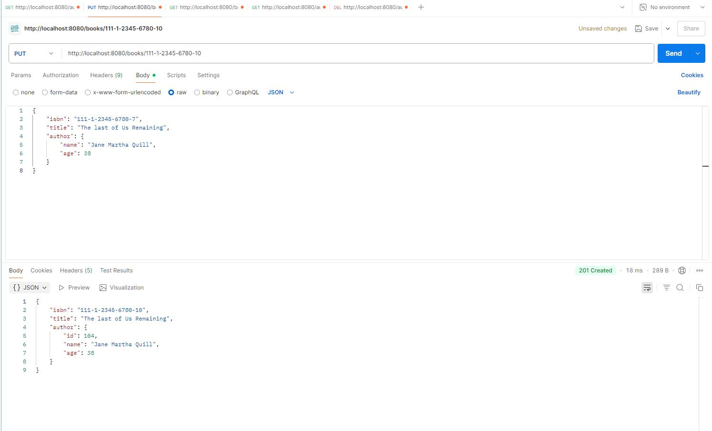
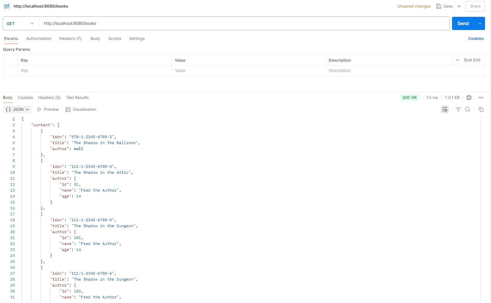
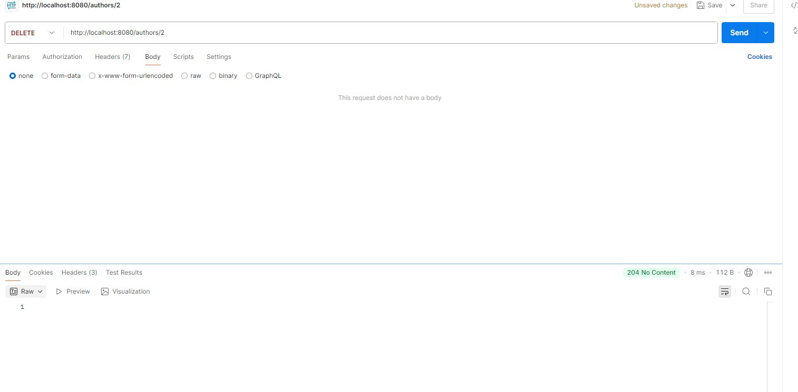

# BookApi
 This project is a RESTful API built with Spring Boot that allows for managing a collection of authors and their books. It supports full CRUD operations, leverages Spring Data JPA for database interaction, and includes integration tests for endpoints. Ideal for learning how to structure and test a basic Spring Boot application.
## Features
- Create, Read, Update, Delete (CRUD) for Authors and Books
- DTOs and Mappers for clean data handling
- Integration Testing using MockMvc
- Database support with H2 (dev) and PostgreSQL (prod)
- Built using Spring Boot, Spring Web, Spring Data JPA, Lombok

## Example of Create or Update 

## Example of Read

## Example of Delete

